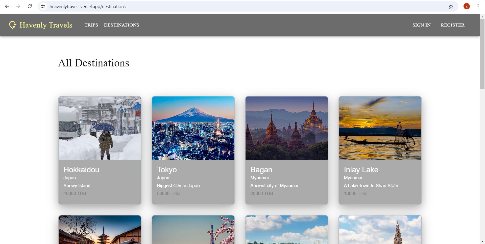

# Havenly Travels (Travel Booking Platform)

Welcome to Havenly Travels, the Travel Booking Platform! This project is built with Next.js and Material-UI to provide a seamless and visually appealing user experience.

## Team Members

- [Zwe La Pyae](https://github.com/ZweLaPyae/project02)
- [Khant Min Lwin](https://github.com/hydromelonn229/project02)
- [Thet Myat Noe Thwin](https://github.com/juliaizbroke/project02)

## Project Description

Havenly Travels is a comprehensive web-based travel management platform that streamlines the process of exploring destinations, booking trips, and managing itineraries. Designed to simplify the travel experience, the platform offers users the ability to browse a variety of destinations, make bookings, and manage their trips with ease. Additionally, an admin panel ensures that the destination content remains up-to-date and relevant. Powered by a REST API, Havenly Travels handles all essential CRUD operations, making it an efficient and user-friendly solution for both travelers and administrators.

## Key Features

***For Guest Users:***
- **Registration and Sign in:** Register and sign in to account.
- **Browse and Search Trips and Destinations**: Explore various travel destinations and trips and search for the desired ones.

***For Registered Users:***
- **Sign in:** Sign in to account.
- **Browse and Search Trips and Destinations**: Explore various travel destinations and trips and search for the desired ones.
- **Edit Profile:** Edit details such as age, country, phone number, profile image and description.
- **Manage Booked Trips:** Book the desired trips. View the booked trips. Cancel unwanted booked trips.

***For Admin:***
- **Sign in:** Sign in to account.
- **Edit Profile:** Edit details such as age, country, phone number, profile image and description.
- **Manage Trips and Destinations**: Admins can add, edit, and delete trips and destinations.

## Data Models
***Trips:***
- **Create(POST):** Admin can add trips.
- **Read(GET):** Guest users and Travelers(Registered users) can explore various trips.
- **Update(PUT):** Admin can edit trips.
- **Delete(DELETE):** Admin can delete trips.

***Destinations:***
- **Create(POST):** Admin can add destinations.
- **Read(GET):** Guest users and Travelers(Registered users) can explore various destinations.
- **Update(PUT):** Admin can edit destinations.
- **Delete(DELETE):** Admin can delete destinations.

***Travelers:***
- **Create(POST):** Users register to become a Traveler(Registered User).
- **Read(GET):** Travelers can check profile and booked trips.
- **Update(PUT):** Travelers can add(book) trips.
- **Delete(DELETE):** Travelers can delete booked trips.

## Screenshots

### Home Page

### Trips Page & TripDetails Page

### Destinations Page

### SignIn Page

### Register Page

### Profile Page

### Booked Trips

### Admin POV

